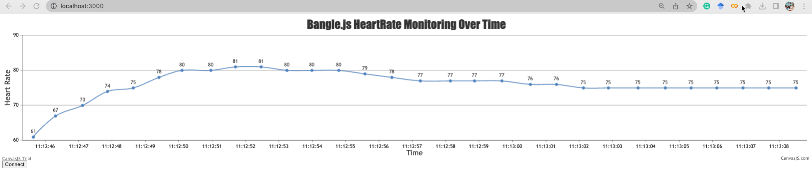
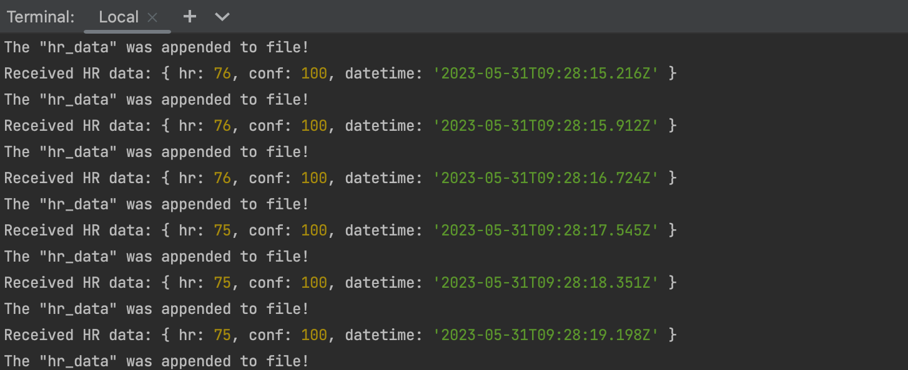
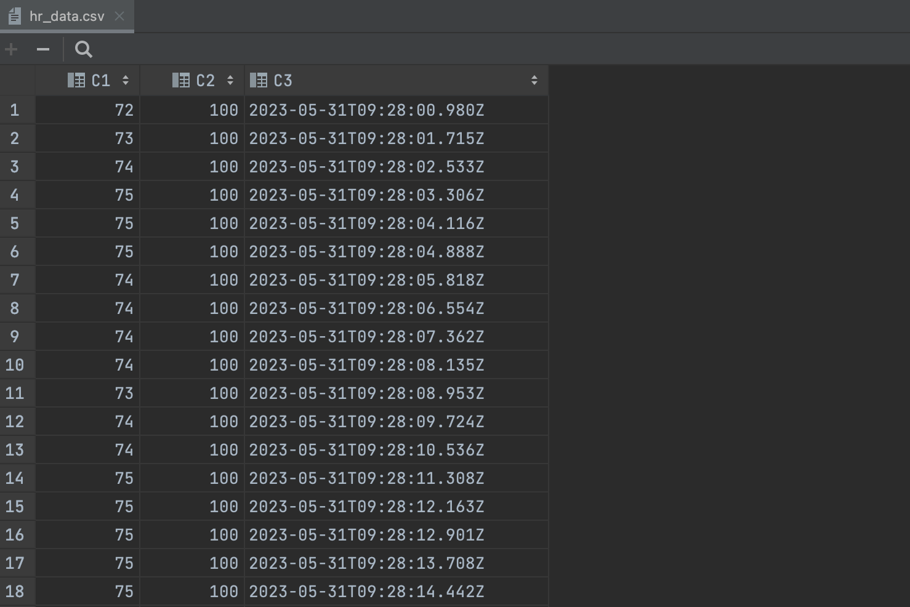
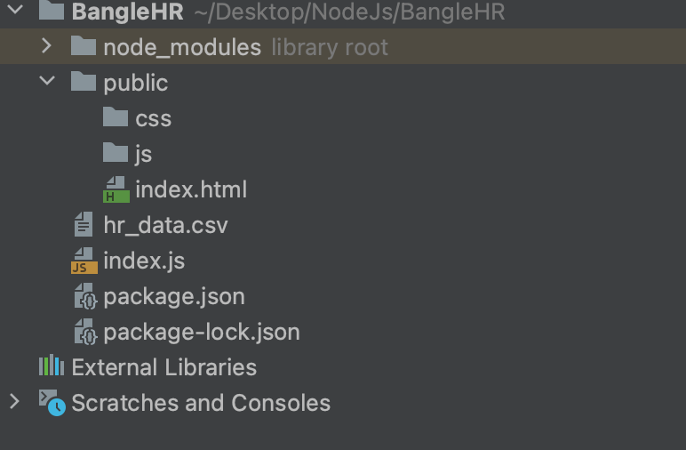

# Bangle.js Heart Rate Monitor

This is a simple Node.js application that collects heart rate data from a Bangle.js watch. The heart rate data is sent to an Express server via WebSockets and saved to a CSV file.

## Project Structure

- `public/`: This folder contains the client-side HTML, CSS, and JavaScript files.
- `index.js`: This is the main server file where we setup our Express server and handle incoming heart rate data.
- `hr_data.csv`: This file is where the heart rate data will be stored.

## Getting Started

These instructions will get you a copy of the project up and running on your local machine for development and testing purposes.

### Prerequisites

Ensure you have Node.js installed on your machine. You can download Node.js from [here](https://nodejs.org/).

### Installation

1. Clone the project from GitHub.
   git clone <github_repo_url>

2. Navigate into the project directory.
   cd <project_directory>

3. Install the project dependencies.
   npm install

### Running the application

1. Start the server by running the following command in your terminal:
   node index.js

2. Open a browser and navigate to `localhost:3000`.

3. Connect your Bangle.js watch to your machine. The application should start receiving heart rate data, and the data will be stored in the `hr_data.csv` file.

## Usage

Once the application is running and your Bangle.js watch is connected, the watch will send heart rate data to the application. The data will then be displayed in real-time on the browser.

The data is stored in the `hr_data.csv` file in the following format:
hr,conf,datetime
75,100,2023-05-31T09:23:40.937Z

Each line represents one reading, with the heart rate (`hr`), confidence level (`conf`), and the timestamp (`datetime`) of the reading.

## Built With

- [Node.js](https://nodejs.org/)
- [Express](https://expressjs.com/)
- [Socket.IO](https://socket.io/)
- [Espruino](https://www.espruino.com/Bangle.js+Data+Streaming)

## License

This project is licensed under the MIT License - see the LICENSE.md file for details.

## Acknowledgements

- The Bangle.js community for the open-source smartwatch that made this project possible.

